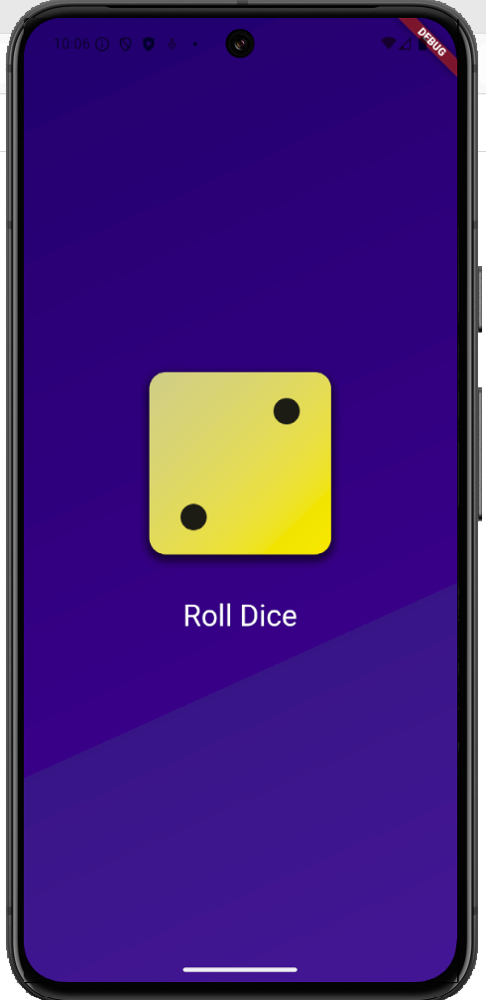
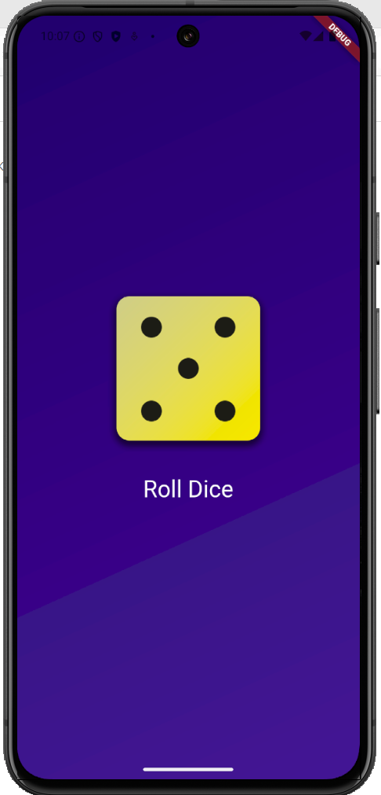

# FIRST_APP

Mobile application developed with **Flutter and Dart** as a first personal project.  
The app displays a dice on screen that changes its face every time the user presses a button, based on a randomly generated number.

## Preview

 



## Features
- Random number generation
- Dynamic dice face change
- Simple and clean user interface
- Button-based user interaction

## Technologies
- Flutter
- Dart
- Android

## Test Device
- **Device:** Pixel 8  
- **Operating System:** Android 15 (Vanilla Ice Cream)

## Installation

1. Clone the repository:
   ```bash
   git clone https://github.com/IsaPortuguez/First_App.git

2. Navigate to the project directory:

    ```bash
    cd first_app

3. Install dependencies:

    ```bash
    flutter pub get

4. Run the application:

    ```bash
    flutter run

## Usage

- Press the button displayed on the screen
- The dice will change its face according to a randomly generated number
- Each press produces a different result

## Project Structure

```text
FIRST_APP/
├── assets/
│   ├── images/           # Images used by the app (dice faces)
│   └── screenshots/      # Images for the README
├── lib/                  # Main application code
│   ├── main.dart
│   ├── dice_roller.dart
│   ├── gradient_container.dart
│   └── styled_text.dart
├── android/              # Native Android code
├── ios/                  # Native iOS code
├── linux/                # Linux support
├── macos/                # macOS support
├── web/                  # Web support
├── windows/              # Windows support
├── test/                 # Automated tests
│   └── widget_test.dart
├── .gitignore            # Files ignored by Git
├── pubspec.yaml          # Dependencies and configuration
├── README.md             # Project documentation```


## Project Status

✅ Completed (first learning project)

## Author

Developed by Isabel Portuguez Calderon
GitHub: https://github.com/IsaPortuguez

## Notes 

This project was created for educational purposes as an introduction to mobile app development using Flutter.

## Acknowledgements

This app was created following a course on Udemy:  
[Flutter & Dart - The Complete Guide [2025 Edition]](https://www.udemy.com/course/learn-flutter-dart-to-build-ios-android-apps/)

Special thanks to the instructor for the guidance.

## Resources

If you're new to Flutter, these resources might help you:

- [Write your first Flutter app](https://docs.flutter.dev/get-started/codelab)
- [Flutter Cookbook](https://docs.flutter.dev/cookbook)
- [Flutter Documentation](https://docs.flutter.dev/)
